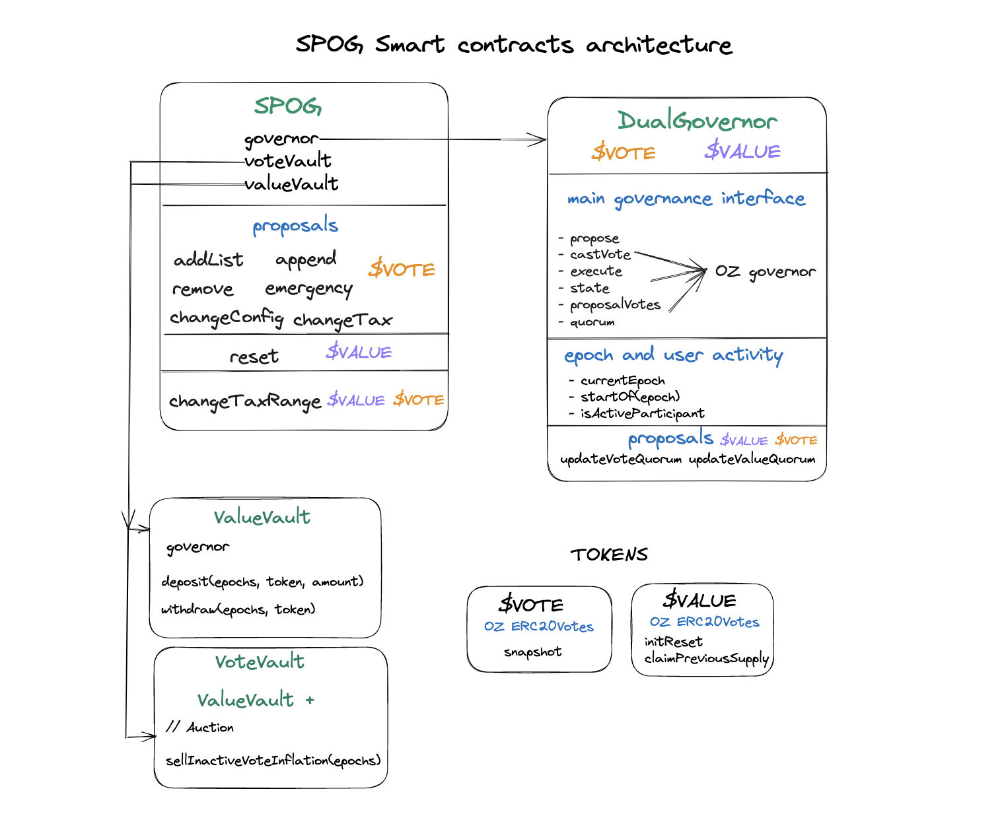

# Simple Participation Optimized Governance (SPOG)

A SPOG, "Simple Participation Optimized Governance," is a governance mechanism that uses token voting to maintain lists and manage communal property. As its name implies, it primarily optimizes for token holder participation. A SPOG is primarily used for **permissioning actors** and should not be used for funding/financing decisions.


## SPOG Smart Contract Architecture



## Using the NPM Package

```bash
npm i @mzero-labs/spog
```

This installs the contract artifacts as a node module for use in Javascript projects.

Example:

```
const ListABI = require("@mzero-labs/spog").List;
```

For Typescript bindings, consider adding [TypeChain](https://github.com/dethcrypto/TypeChain) to your project. It can parse the artifacts found in `node_modules/@mzero-labs/spog/out` as a `postinstall` step.

## Dev Setup

Clone the repo and install dependencies

### Prerequisites

To setup the app, you need to install the toolset of prerequisites foundry.

Follow the instructions: https://book.getfoundry.sh/getting-started/installation

#### IMPORTANT

Use a pinned version of foundry for stability pre-1.0 release

```bash
foundryup --version nightly-e15e33a07c0920189fc336391f538c3dad53da73
```

This is also the version used for CI

After that you can download dependencies, compile the app and run the tests.

```bash
 forge install
```

To compile the contracts

```bash
 forge build
```

## Test

To run all tests

```bash
 forge test
```

Run test that matches a test contract

```bash
 forge test --mc <test-contract-name>
```

Test a specific test case

```bash
 forge test --mt <test-case-name>
```

To view test coverage

Note: On Linux, install genhtml. On MacOS, `brew install lcov`

```bash
 make -B coverage
```

You can then view the file coverage/index.html to view the report. This can also be integrated into vs code with various extentions

## Local dApp Development using Anvil

Start the local anvil node

```bash
anvil
```

In another terminal, run the deployment script for Anvil

```bash
make deploy-spog-local
```

You can now do local development and testing against the RPC endpoint http://localhost:8545

## Testnet

### Sepolia

```
  deployer: 0x31DCb7AE01fFfD9B6468814bA2A6A0ab9c58d8e5
  predicted SPOG address:  0x680dBfa52bf6CA633dF837f961f50EA6456e9E00
  SPOG address:  0x680dBfa52bf6CA633dF837f961f50EA6456e9E00
  SPOGFactory address:  0x7BcFff5D009C0ff0492e877eEF3f75127561CE63
  SPOGVote token address:  0xB6A1AF2595Ca04870e45150b61FCf83C8a47A252
  SPOGValue token address:  0xF6b56E5C7fcDaeca68D8FEe374331357a48B2f90
  SPOGGovernor for $VOTE address :  0x295Bee3C816C0f42eDaA1c822c338C0eb00bbA16
  SPOGGovernor for $VALUE address :  0xAc3de37d4d52cf6cA8CC966c7F7Bd79720C5a1DE
  Cash address:  0x7b7E36A667F0Dd96B617343a12fB04e52C80BC2D
  Vault address:  0x05872592c3F8653C1291E46574b99cc7e69939a5
```
