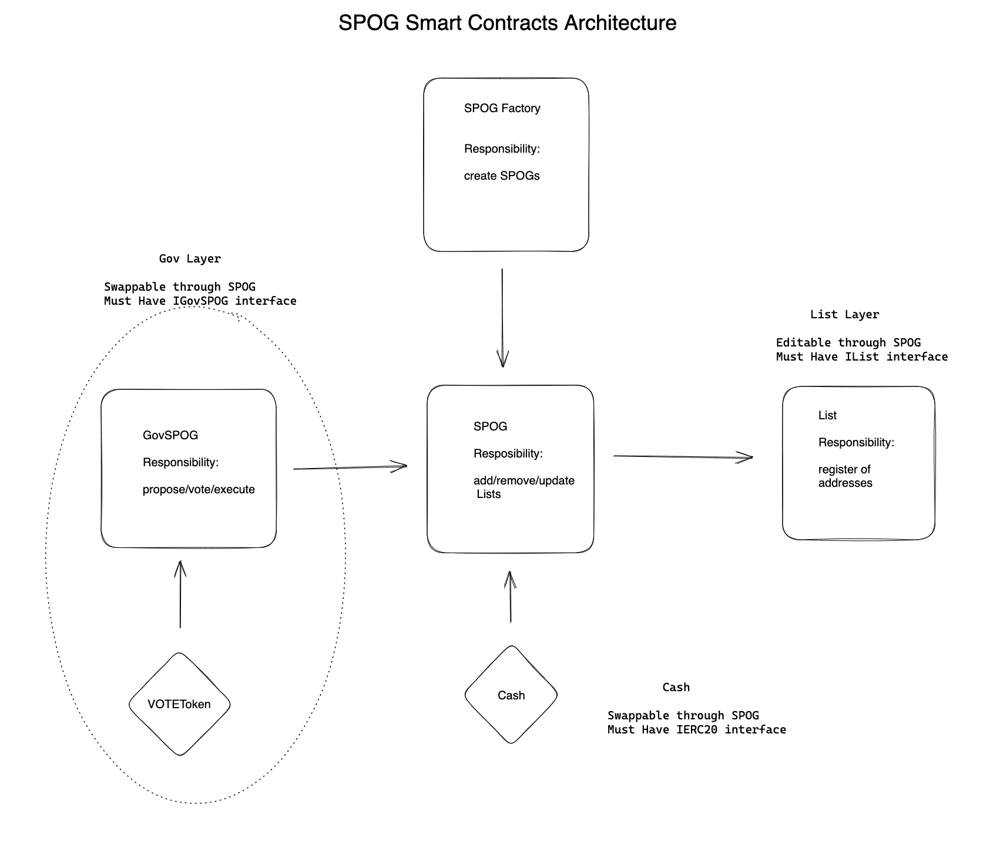

# Simple Participation Optimized Governance (SPOG)

A SPOG, "Simple Participation Optimized Governance," is a governance mechanism that uses token voting to maintain lists and manage communal property. As its name implies, it primarily optimizes for token holder participation. A SPOG is primarily used for **permissioning actors** and should not be used for funding/financing decisions.


## SPOG Smart Contract Architecture



## Setup

Clone the repo and install dependencies

### Prerequisites

To setup the app, you need to install the toolset of prerequisites foundry.

Follow the instructions: https://book.getfoundry.sh/getting-started/installation

After that you can download dependencies, compile the app and run the tests.

```bash
 forge install
```

To build the project

```bash
 forge build
```

## Test

```bash
 forge test
```
