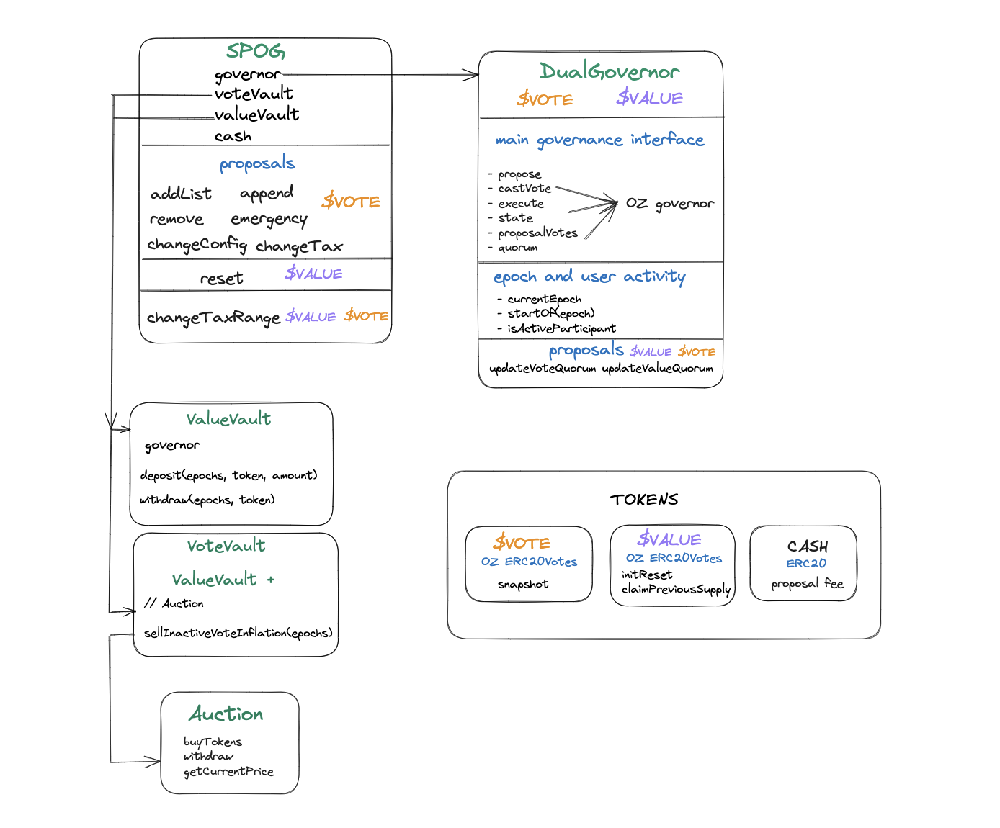

# Simple Participation Optimized Governance (SPOG)

A SPOG, "Simple Participation Optimized Governance," is a governance mechanism that uses token voting to maintain lists and manage communal property. As its name implies, it primarily optimizes for token holder participation. A SPOG is primarily used for **permissioning actors** and should not be used for funding/financing decisions.


## SPOG Smart Contract Architecture




## Dev Setup

Clone the repo and install dependencies

### Prerequisites

To setup the app, you need to install the toolset of prerequisites foundry.

Follow the instructions: https://book.getfoundry.sh/getting-started/installation

#### IMPORTANT

Use a pinned version of foundry for stability pre-1.0 release

```bash
foundryup --version nightly-e15e33a07c0920189fc336391f538c3dad53da73
```

This is also the version used for CI

After that you can download dependencies, compile the app and run the tests.

```bash
 forge install
```

To compile the contracts

```bash
 forge build
```

## Test

To run all tests

```bash
 forge test
```

Run test that matches a test contract

```bash
 forge test --mc <test-contract-name>
```

Test a specific test case

```bash
 forge test --mt <test-case-name>
```

To view test coverage

Note: On Linux, install genhtml. On MacOS, `brew install lcov`

```bash
 make -B coverage
```

You can then view the file coverage/index.html to view the report. This can also be integrated into vs code with various extentions

## Local dApp Development using Anvil

Start the local anvil node

```bash
anvil
```

In another terminal, run the deployment script for Anvil

```bash
make deploy-spog-local
```

You can now do local development and testing against the RPC endpoint http://localhost:8545


## Deployment

The deployment script uses an environment variable `MNEMONIC` to derive the deployment account. 

* For development, a test mnemonic is used by default. The wallet will have ETH on Hardhat or Anvil.
* For testnet or mainnet deployments, you will want to use a private mnemonic.

The deployment script also uses an environment variable `WETH_ADDRESS`. If this is provided, it is used as the internal payment token for proposals. If it is not provided, the script deploys a mock ERC20 and mints tokens (for mnemonics only. See next section)

### Minting and delegation during deployment 

The deployment script first checks for `script/data/distributionList.json` and if the file exists, it uses it for the initial distribution and delegation

If the distribution file does not exist, it falls back to using a Mnemonic.

When using a mnemonic, it generates 20 accounts and mints 100_000e18 tokens for all of them.